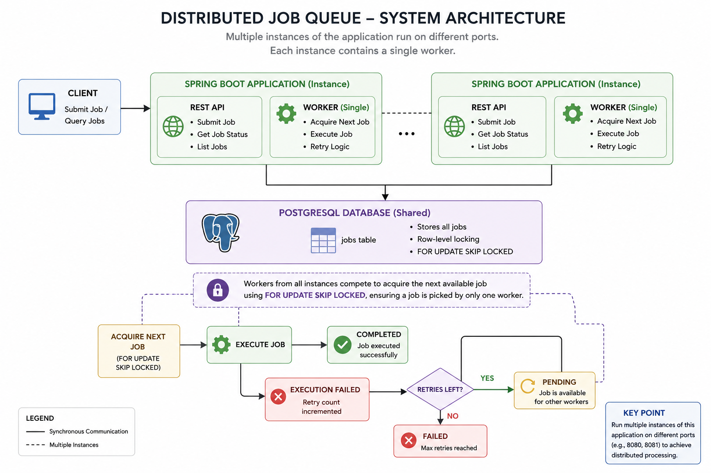

# Distributed Job Queue

A distributed job queue built with Spring Boot and PostgreSQL that enables reliable asynchronous job processing using multiple worker instances. The system supports concurrent execution, transactional job processing, automatic retries, and PostgreSQL row-level locking (`FOR UPDATE SKIP LOCKED`) to ensure that each job is processed by only one worker.

---

## Features

* Distributed worker architecture
* Concurrent job processing
* Persistent PostgreSQL-backed queue
* Row-level locking with `FOR UPDATE SKIP LOCKED`
* Automatic retry mechanism
* Configurable maximum retry attempts
* Transactional job processing
* Dockerized deployment
* Extensible job execution framework

---

## System Architecture
## System Architecture

<p>
  
</p>

---

## Processing Flow

1. Client submits a job using the REST API.
2. The job is stored in PostgreSQL with `PENDING` status.
3. Multiple worker instances continuously poll the queue.
4. Workers atomically acquire jobs using `FOR UPDATE SKIP LOCKED`.
5. The selected worker executes the job inside a transaction.
6. Successful jobs are marked as `COMPLETED`.
7. Failed jobs increment the retry count.
8. Jobs with remaining retries return to `PENDING`; otherwise they become `FAILED`.

---

## Tech Stack

* Java 21
* Spring Boot
* Spring Data JPA
* PostgreSQL
* Docker
* Maven

---

## Project Structure

```text
src
├── controller
├── service
├── repository
├── worker
├── execution
├── entity
├── config
└── exception
```

---

## API Endpoints

| Method | Endpoint   | Description             |
| ------ | ---------- | ----------------------- |
| POST   | /jobs      | Submit a new job        |
| GET    | /jobs      | Retrieve all jobs       |
| GET    | /jobs/{id} | Retrieve a specific job |

---

## Running the Project

1. Clone the repository.
2. Start PostgreSQL.
3. Configure the database connection.
4. Run the Spring Boot application.
5. Submit jobs using the REST API.
6. Start multiple application instances to simulate distributed workers.

---

## Performance

Current implementation demonstrates:

* Concurrent processing using multiple workers
* Automatic retry mechanism
* Transaction-safe execution
* Distributed processing using PostgreSQL row-level locking
* Successful execution of 100 jobs using 2 concurrent workers