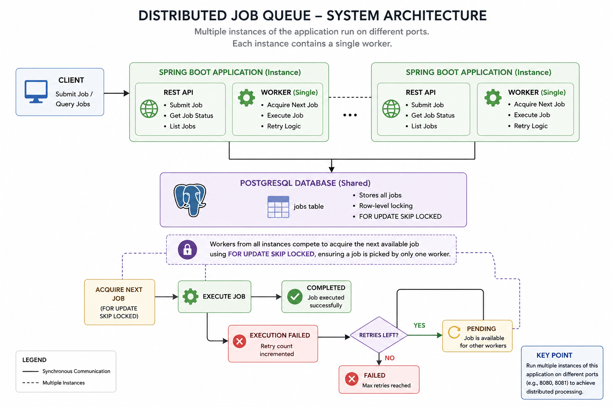

# Distributed Job Queue

A production-oriented distributed job queue built with **Java 21, Spring Boot, and PostgreSQL** for reliable asynchronous job processing across multiple worker instances.

The system supports **concurrent job execution, transactional job processing, automatic retries, delayed and scheduled jobs, crash recovery, PostgreSQL row-level locking, and operational metrics**.

The queue uses **at-least-once processing semantics**. PostgreSQL's `FOR UPDATE SKIP LOCKED` provides exclusive concurrent job acquisition, preventing competing workers from acquiring the same job at the same time.

---

## Features

* Distributed worker architecture
* Concurrent job processing across multiple worker instances
* Persistent PostgreSQL-backed queue
* PostgreSQL row-level locking with `FOR UPDATE SKIP LOCKED`
* Exclusive job acquisition among competing workers
* At-least-once job processing
* Automatic retries with configurable maximum attempts
* Delayed and scheduled job dispatch
* Priority-based job processing
* Automated recovery of orphaned/stuck jobs
* Transactional job state transitions
* Execution history and lifecycle tracking
* Queue and worker observability metrics
* REST API for job submission and monitoring
* Dockerized deployment
* Apache JMeter performance testing
* Extensible job execution framework

---

## System Architecture

<p>
  
</p>

The system separates job persistence, scheduling, worker coordination, execution, and failure recovery into independent responsibilities.

---

## Processing Flow

### 1. Job Submission

A client submits a job through the REST API.

The job is persisted in PostgreSQL with a `PENDING` status.

For delayed jobs, the requested execution timestamp is stored with the job.

### 2. Job Polling

Worker instances continuously poll PostgreSQL for executable jobs.

Workers select pending jobs using PostgreSQL row-level locking:

```sql
SELECT ...
FROM jobs
WHERE status = 'PENDING'
  AND scheduled_at <= CURRENT_TIMESTAMP
ORDER BY priority DESC, created_at ASC
FOR UPDATE SKIP LOCKED
LIMIT ?;
```

`SKIP LOCKED` allows workers to skip rows already locked by another worker instead of waiting for them.

### 3. Job Acquisition

Once a worker acquires a job, its state transitions from:

```text
PENDING → PROCESSING
```

The acquisition and state transition are performed transactionally.

### 4. Job Execution

The selected worker executes the job using the configured execution framework.

Execution state and results are recorded as part of the job lifecycle.

### 5. Successful Completion

After successful execution:

```text
PROCESSING → COMPLETED
```

Execution metadata can be persisted for historical tracking and operational analysis.

### 6. Failure and Retry

When execution fails, the job's attempt count is incremented.

If attempts remain:

```text
PROCESSING → PENDING
```

The job becomes eligible for another attempt.

If the maximum number of attempts is exhausted:

```text
PROCESSING → FAILED
```

### 7. Crash Recovery

A worker can crash after acquiring a job but before completing it.

The job may then remain in:

```text
PROCESSING
```

The recovery scheduler does **not** immediately retry the job.

It periodically checks how long the job has remained in the `PROCESSING` state.

If the job has been in `PROCESSING` for **less than 5 minutes**, it is left untouched because the worker may still be actively executing it.

If the job has remained in `PROCESSING` for **5 minutes or longer**, it is considered stale and eligible for recovery.

The stale job is reclaimed and returned to the processing pipeline.

---

## Processing Semantics

The queue provides **at-least-once processing semantics**.

`FOR UPDATE SKIP LOCKED` prevents competing workers from concurrently acquiring the same database row, but database locking alone cannot guarantee exactly-once execution.

For example, a worker may successfully perform an external side effect and then crash before recording the completion state. Recovery can subsequently cause the job to execute again.

Therefore:

```text
Exclusive acquisition ≠ Exactly-once execution
```

For jobs that produce externally visible side effects, **idempotency** should be used where required.

The system therefore focuses on:

* Durable job persistence
* Exclusive concurrent acquisition
* Transactional state transitions
* Automatic retries
* Crash recovery
* At-least-once processing

---

## Database Concurrency

The core concurrency mechanism is PostgreSQL row-level locking:

```sql
FOR UPDATE SKIP LOCKED
```

Without appropriate locking, multiple workers could read the same `PENDING` job before either worker updates its state.

With `SKIP LOCKED`, workers can acquire different jobs concurrently without waiting on rows already claimed by another worker.

The queue also uses indexes on frequently queried job state and scheduling fields to reduce unnecessary database scanning.

---

## Job Lifecycle

```text
                     ┌──────────────┐
                     │   PENDING    │
                     └──────┬───────┘
                            │
                            ▼
                     ┌──────────────┐
                     │  PROCESSING  │
                     └──────┬───────┘
                            │
                ┌───────────┴───────────┐
                │                       │
             Success                  Failure
                │                       │
                ▼                       ▼
        ┌──────────────┐        Retry available?
        │  COMPLETED   │              │
        └──────────────┘        ┌──────┴──────┐
                                │             │
                               Yes            No
                                │             │
                                ▼             ▼
                           ┌─────────┐   ┌──────────┐
                           │ PENDING │   │  FAILED  │
                           └─────────┘   └──────────┘


        Worker crash / unexpected termination
                         │
                         ▼
                  ┌──────────────┐
                  │  PROCESSING  │
                  └──────┬───────┘
                         │
                  Less than 5 min
                         │
                         ▼
                 Continue processing


                  PROCESSING
                         │
                  5 min or longer
                         │
                         ▼
                  ┌──────────────┐
                  │   RECOVERY   │
                  └──────┬───────┘
                         │
                         ▼
                  ┌──────────────┐
                  │    PENDING   │
                  └──────────────┘
                         │
                         ▼
                   Retry eligible
```

A job entering `PROCESSING` is **not immediately considered abandoned**.

If a worker is still processing a job, the job remains in the `PROCESSING` state.

The recovery mechanism only considers a job stale when it has remained in `PROCESSING` for **5 minutes or longer**.

Therefore:

```text
PROCESSING < 5 minutes
        ↓
Continue processing

PROCESSING ≥ 5 minutes
        ↓
Considered stale
        ↓
Recovery
        ↓
PENDING
        ↓
Eligible for another attempt
```

This 5-minute threshold prevents the recovery scheduler from incorrectly retrying long-running jobs that are still being executed.

---

## Scheduling

The queue supports delayed and scheduled jobs through an execution timestamp.

Workers only acquire jobs whose scheduled time has been reached.

This allows the system to support:

* Immediate jobs
* Delayed jobs
* Scheduled jobs
* Priority-based dispatch

Jobs are ordered using:

```text
priority DESC
created_at ASC
```

This allows higher-priority work to be considered before older lower-priority jobs.

---

## Retry Mechanism

Jobs support configurable retry limits.

Example:

```text
Attempt 1
   │
   ├── Success ───────► COMPLETED
   │
   └── Failure
          │
          ▼
      Attempt 2
          │
          ├── Success ───────► COMPLETED
          │
          └── Failure
                 │
                 ▼
             Attempt 3
                 │
                 ├── Success ───────► COMPLETED
                 │
                 └── Failure ───────► FAILED
```

Retries allow transient failures to recover without immediately marking the job as permanently failed.

The **5-minute recovery threshold is separate from the normal execution retry mechanism**.

It is specifically used to identify jobs that may have been abandoned because of worker failure.

---

## Failure Recovery

The recovery scheduler handles jobs abandoned by workers that terminate unexpectedly.

A job is not immediately retried simply because it is in the `PROCESSING` state.

The recovery scheduler periodically checks how long each job has remained in `PROCESSING`.

If a job has been in the `PROCESSING` state for **less than 5 minutes**, it is left untouched because the worker may still be actively executing it.

If a job has remained in `PROCESSING` for **5 minutes or longer**, it is considered stale and eligible for recovery.

The recovery flow is:

```text
PROCESSING
     │
     │ < 5 minutes
     ▼
Worker may still be active
     │
     └──► Continue processing


PROCESSING
     │
     │ ≥ 5 minutes
     ▼
Recovery Scheduler
     │
     ▼
Stale Job Detected
     │
     ▼
Return to PENDING
     │
     ▼
Eligible for Retry
```

This protects the system from permanently stuck jobs caused by:

* Application crashes
* Worker termination
* Container restarts
* Unexpected process termination

while avoiding premature retries of jobs that are legitimately taking several minutes to execute.

The **5-minute threshold is a recovery safety mechanism**, not the normal retry delay for execution failures.

---

## Metrics & Observability

The system exposes operational metrics for monitoring queue health, worker utilization, processing latency, and failure behavior.

### Application Metrics

| Metric                         | Type              | Description                                     |
| ------------------------------ | ----------------- | ----------------------------------------------- |
| `job.queue.depth`              | Gauge             | Current number of `PENDING` jobs                |
| `job.processing.duration`      | Timer / Histogram | Job processing duration and latency percentiles |
| `job.execution.success.total`  | Counter           | Successfully completed jobs                     |
| `job.execution.retry.total`    | Counter           | Jobs that triggered retry attempts              |
| `job.recovery.triggered.total` | Counter           | Orphaned jobs reclaimed by recovery             |
| `worker.active.count`          | Gauge             | Number of active worker threads                 |

These metrics can be used to investigate:

* Queue buildup
* Worker utilization
* Processing latency
* Retry spikes
* Recovery activity
* Throughput bottlenecks
* P95/P99 latency

The application exposes health and metrics endpoints through **Spring Boot Actuator** and uses **Micrometer** for application instrumentation and Prometheus-compatible metrics.

### Performance & Load Testing

**Apache JMeter** is used to generate concurrent HTTP workloads against the job queue API and evaluate system behavior under load.

JMeter testing focuses on:

* Requests per second
* Throughput
* Average response time
* P90/P95/P99 latency
* Maximum response time
* Error rate
* Concurrent request handling
* Database connection-pool pressure
* Queue behavior under sustained load

JMeter is used as a **performance and load-testing tool**, while Actuator, Micrometer, and Prometheus-compatible metrics provide application-level observability.

---

## Performance Testing

The system has been tested with concurrent workloads using **Apache JMeter** to evaluate API performance, queue behavior, and database interaction.

Testing focuses on:

* Jobs processed per second
* Total workload completion time
* HTTP requests per second
* Worker concurrency
* Queue depth
* Database connection-pool utilization
* Processing latency
* P90/P95/P99 latency
* Maximum response time
* Error rate
* Recovery behavior
* System behavior under sustained concurrent load

Performance depends on workload characteristics, job execution time, worker concurrency, PostgreSQL configuration, connection-pool sizing, and hardware.

### JMeter Load Testing

JMeter can be used to simulate concurrent clients submitting jobs and interacting with the REST API.

The resulting measurements can be used to analyze:

```text
Concurrent Requests
        ↓
HTTP Throughput
        ↓
Application Processing
        ↓
Database Load
        ↓
Queue Growth
        ↓
Worker Utilization
        ↓
Latency / Errors
```

Representative benchmark results should always include the corresponding test configuration, including concurrency, workload size, worker count, database configuration, and hardware.

---

## Tech Stack

### Core

* **Java 21**
* **Spring Boot**
* **Spring Data JPA**
* **PostgreSQL**
* **Maven**

### Infrastructure

* **Docker**

### Observability

* **Spring Boot Actuator**
* **Micrometer**
* **Prometheus-compatible metrics**

### Performance Testing

* **Apache JMeter**

---

## Project Structure

```text
src
├── DistributedJobQueueApplication.java
│
├── job
│   # Job creation, lifecycle management,
│   # persistence and status tracking
│   ├── controller
│   ├── service
│   ├── dto
│   ├── repository
│   ├── entity
│   └── enums
│
├── worker
│   # Worker coordination, configuration,
│   # scheduling and failure recovery
│   ├── JobScheduler
│   ├── JobRecoveryScheduler
│   ├── WorkerService
│   ├── WorkerConfig
│   │
│   └── scheduledJobWorker
│       ├── ScheduledJobDispatchScheduler
│       └── ScheduledJobScheduler
│
└── execution
    # Job execution lifecycle and
    # execution result management
    ├── service
    ├── repository
    ├── entity
    └── enums
```

---

## API Endpoints

| Method | Endpoint     | Description             |
| ------ | ------------ | ----------------------- |
| `POST` | `/jobs`      | Submit a new job        |
| `GET`  | `/jobs`      | Retrieve all jobs       |
| `GET`  | `/jobs/{id}` | Retrieve a specific job |

---

## Running the Project

### 1. Clone the repository

```bash
git clone https://github.com/abhishekp-backend/distributed-job-queue/
cd distributed-job-queue
```

### 2. Start PostgreSQL

Start PostgreSQL locally or using Docker.

### 3. Configure the database

Configure the PostgreSQL connection in:

```text
application.yml
```

### 4. Start the application

```bash
mvn spring-boot:run
```

### 5. Submit jobs

Use the REST API:

```http
POST /jobs
```

### 6. Run multiple workers

Start multiple application instances connected to the same PostgreSQL database.

Each instance participates in distributed job acquisition using PostgreSQL row-level locking.

---

## Reliability Model

The queue combines several mechanisms to provide reliable asynchronous processing:

* Persistent job state
* Transactional updates
* PostgreSQL row-level locking
* Automatic retries
* Delayed scheduling
* 5-minute stale-job recovery
* Orphan job recovery
* Operational metrics

Together, these mechanisms allow the system to continue processing work despite worker failures while providing visibility into queue health and processing behavior.

---

## Engineering Concepts Demonstrated

### Distributed Systems

* Distributed worker coordination
* Concurrent job acquisition
* At-least-once processing
* Failure recovery
* Retry semantics
* Idempotency considerations

### Database Systems

* PostgreSQL transactions
* Row-level locking
* `FOR UPDATE SKIP LOCKED`
* Index-aware queue queries
* Connection-pool behavior
* Persistent state machines

### Backend Engineering

* Spring Boot
* Spring Data JPA
* REST APIs
* Transaction boundaries
* Background schedulers
* Extensible execution architecture

### Production Engineering

* Dockerized deployment
* Health checks
* Operational metrics
* Queue-depth monitoring
* Latency monitoring
* Failure and recovery observability
* Apache JMeter load testing
* Performance analysis

---

## Future Improvements

Potential extensions include:

* Exponential backoff with jitter
* Dead-letter queue support
* Explicit idempotency keys
* Job cancellation
* Worker heartbeats and leases
* Per-queue concurrency limits
* Rate limiting
* Queue-depth-based autoscaling
* Prometheus + Grafana dashboards
* Kubernetes deployment
* Distributed tracing
* Improved fairness between priorities
* Database partitioning for very large queues
* Message-broker-backed implementation for comparison

---

## Engineering Goal

The project explores how to build a reliable asynchronous processing system using **PostgreSQL as both the persistent job store and coordination mechanism**.

The main engineering challenges are:

```text
Concurrency
     ↓
Transactional State
     ↓
Failure Handling
     ↓
Retries
     ↓
Crash Recovery
     ↓
Observability
     ↓
Performance
     ↓
Scalability
```

The goal is to understand the engineering trade-offs involved in building a **fault-tolerant, concurrent, observable distributed worker system**.
